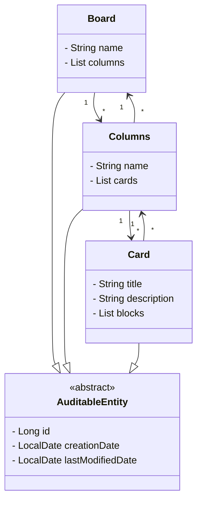

# 📌 Board de Tarefas  

API Rest feita em java, que permite gerenciar um **board de tarefas**. 
---

## 🚀 Tecnologias Utilizadas  
- **Java 17**  
- **Spring Boot**
- **Lombok** 
- **Hibernate**
- **Jakarta Persistence API**
- **Banco de Dados H2**  
 
## 📌 Funcionalidades  
✅ Adicionar, ler, atualizar e excluir um **Board**  

✅ Adicionar, ler, atualizar e excluir uma **Coluna** 

✅ Adicionar, ler, mover, atualizar, excluir, bloquear e desbloquear um **Card**
  

## 🔜 **Implementações Futuras**  

🔹 Criar testes unitários  
🔹 Criar tratamento de erros  
🔹 fazer a documentação da api 

## 📄 Diagrama de Classes

---
feito com ❤️
