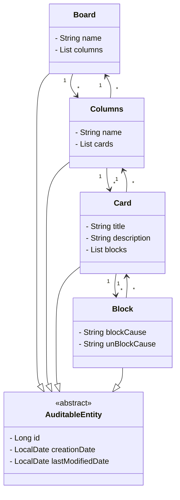

# 📌 Board de Tarefas  

Uma aplicação inspirada nas aulas de integração de sistemas com bancos de dados, do bootcamp **DecolaTech** da **DIO**, desenvolvida com **Java** , que permite gerenciar um **board de tarefas**. 
---

## 🚀 Tecnologias Utilizadas  
- **Java 17**  
- **Spring Boot**  
- **Hibernate & JPA**  
- **Banco de Dados H2**  
- **Lombok**  
- **Jakarta Persistence API**
  
## 📌 Funcionalidades  
✅ Criar um **Board**  
✅ Criar uma **Coluna** dentro de um Board  
✅ Criar um **Card** dentro de uma Coluna  
✅ **Bloquear** um Card  
✅ **Mover Cards** entre Colunas  

## 🔜 **Funcionalidades Futuras**  
🔹 Implementar controle de permissões 
🔹 Refinar regras de negócios  
🔹 Criar tratamento de erros

## 📄 Diagrama de Classes

---
feito com ❤️
